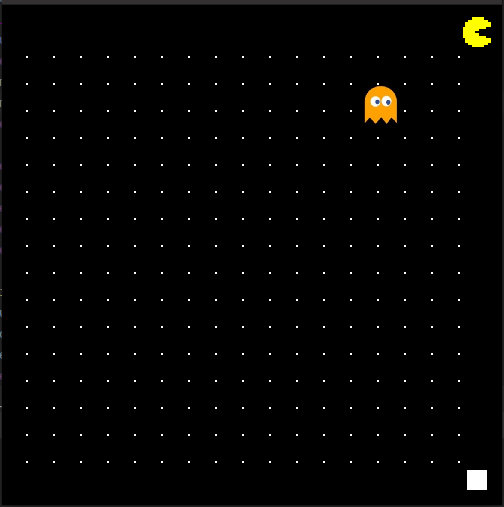

**PAC MAN**

In this project, I took the pac-man version which I had built earlier, and used NEAT evolution algorithm to teach our pac-man to consume maximum possible dots while evading ghosts!
Certain difficulties I faced was:
- determining the population size, and number of generations to run the NEAT algorithm for
- determining what inputs to provide the NEAT neural networks

Eventually, my pac-man trained on my local workstation, could consume half 3/4th of the total dots after being trained for 300 generations. I will continue to look into how to improve this statistic.

# Major Libraries used: 
1. **python-neat** : To run NEAT
2. **pygame** : To develop the underlying pac-man game.

